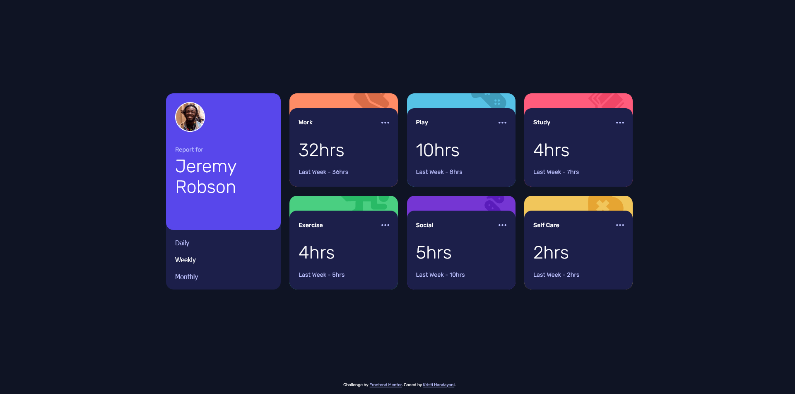

# Frontend Mentor-Time Tracking Dashboard Main
This is my solution to the [Results summary component challenge on Frontend Mentor](https://www.frontendmentor.io/challenges/time-tracking-dashboard-UIQ7167Jw)

## Table of contents
- [Overview](#overview)
  - [The challenge](#the-challenge)
  - [Screenshot](#screenshot)
  - [Links](#links)
- [My process](#my-process)
  - [Built with](#built-with)
  - [Useful resources](#useful-resources)
  - [Extra notes](#extra-notes)

## Overview
### The challenge
Users should be able to:
- View the optimal layout for the site depending on their device's screen size
- See hover states for all interactive elements on the page
- Switch between viewing Daily, Weekly, and Monthly stats

### Screenshot

### Links
[Live Site URL](https://kristihan.github.io/FrontendMentor-TimeTrackingDashboard/)

## My process
### Built with
- Semantic HTML5 markup
- CSS custom properties
- Flexbox
- CSS Grid
- Mobile-first workflow
- Google Fonts
- Javascript

### Useful resources
- [How to Read a JSON File in JavaScript from freeCodeCamp](https://www.freecodecamp.org/news/how-to-read-json-file-in-javascript/)
- [Aria Selected](https://developer.mozilla.org/en-US/docs/Web/Accessibility/ARIA/Attributes/aria-selected)

### Extra Notes
I've changed data.json file to accomodate the needs to populate unique icon and color for each title. For that, I add iconSource which stores the path to the icon and accentColor which stores hsl for the color. 